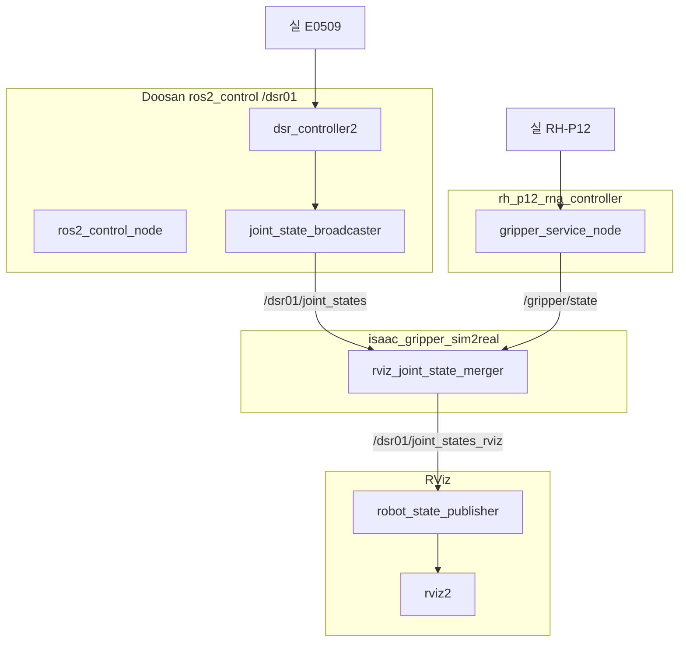
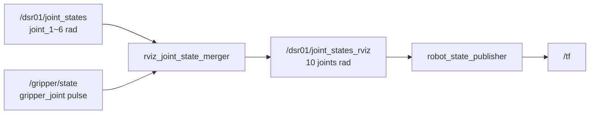
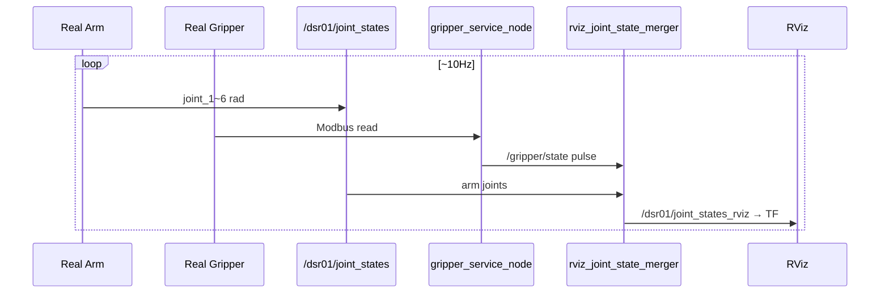

# rviz-gripper-e0509

**실로봇 팔 + 그리퍼**를 RViz에 띄우고, **real → RViz** 로 joint 값을 연동합니다.

Repo: [jasper104615-collab/rviz-gripper-e0509-](https://github.com/jasper104615-collab/rviz-gripper-e0509-)

---

## 사전 준비 (공식 GitHub clone)

| Repo | 용도 |
|------|------|
| [doosan-robot2](https://github.com/DoosanRobotics/doosan-robot2) | bringup, mesh, controller |
| `rh_p12_rna_controller` | 그리퍼 TCP / `/gripper/state` |

---

## repo 구조

```
rviz-gripper-e0509/
├── README.md
├── scripts/install_overlay.sh
├── overlay/
│   ├── doosan/.../e0509_with_gripper.urdf
│   └── rh_p12/.../gripper_node.py
└── ros2_ws/src/
    ├── isaac_gripper_sim2real/
    └── rh_p12_rna_controller_interfaces/
```

---

## 설치

```bash
git clone https://github.com/jasper104615-collab/rviz-gripper-e0509-.git
cd rviz-gripper-e0509-

chmod +x scripts/install_overlay.sh
DOOSAN_SRC=~/doosan-robot2/src/doosan-robot2 \
RH12_SRC=~/rh_p12_rna_controller \
  ./scripts/install_overlay.sh

mkdir -p ~/gripper_rviz_ws/src
cp -r ros2_ws/src/* ~/gripper_rviz_ws/src/
ln -sf ~/rh_p12_rna_controller ~/gripper_rviz_ws/src/

source /opt/ros/humble/setup.bash
source ~/doosan-robot2/install/setup.bash

cd ~/doosan-robot2 && colcon build --packages-select dsr_description2
cd ~/gripper_rviz_ws
colcon build --packages-select \
  rh_p12_rna_controller_interfaces rh_p12_rna_controller isaac_gripper_sim2real

source ~/doosan-robot2/install/setup.bash
source ~/gripper_rviz_ws/install/setup.bash
```

---

## 실행

```bash
source /opt/ros/humble/setup.bash
source ~/doosan-robot2/install/setup.bash
source ~/gripper_rviz_ws/install/setup.bash

ros2 launch isaac_gripper_sim2real real_rviz_with_gripper.launch.py \
  mode:=real host:=110.120.1.40 port:=12345 model:=e0509 robot_ip:=110.120.1.40
```

---

## 작동 방식 — 노드 구조



| 노드 | 패키지 | 역할 |
|------|--------|------|
| `joint_state_broadcaster` | controller_manager | 실 **팔** joint → `/dsr01/joint_states` |
| `gripper_service_node` | rh_p12_rna_controller | 실 **그리퍼** pulse → `/gripper/state` |
| `rviz_joint_state_merger` | isaac_gripper_sim2real | pulse→rad 병합 |
| `robot_state_publisher` | robot_state_publisher | `e0509_with_gripper.urdf` → TF |
| `rviz2` | rviz2 | 시각화 |

---

## Topic 구조



| Topic | Pub | Sub | 데이터 |
|-------|-----|-----|--------|
| `/dsr01/joint_states` | joint_state_broadcaster | merger | `joint_1`~`joint_6` [rad] |
| `/gripper/state` | gripper_service_node | merger | `gripper_joint` [pulse 0~700] |
| `/dsr01/joint_states_rviz` | merger | robot_state_publisher | 팔 6 + `rh_r1,l1,r2,l2` [rad] |
| `/tf` | robot_state_publisher | rviz2 | 링크 transform |

**그리퍼 변환:** pulse 0=열림(0 rad), 700=닫힘(~1.101 rad) — `config/rviz_gripper.yaml`

---

## 시퀀스 (Real → RViz)



---

## Service (참고)

| Service | 용도 |
|---------|------|
| `/dsr01/drl/drl_start` | gripper TCP DRL 주입 (부팅) |
| `/gripper/get_state` | merger 백업 폴링 |
| `/gripper/set_position` | 수동 그리퍼 명령 (선택) |

---

## 확인

```bash
ros2 topic echo /dsr01/joint_states --once
ros2 topic echo /gripper/state --once
ros2 topic echo /dsr01/joint_states_rviz --once
```

---

## URDF

- `urdf/e0509_with_gripper.urdf` — **팔 6축 + RH-P12**
- `link_6` → `rh_p12_rn_base`: Z축 -90° (`rpy="0 0 -1.5708"`)
- mesh: `package://dsr_description2/meshes/...`

---

## 그리퍼 수동 명령 (선택)

```bash
ros2 service call /gripper/set_position \
  rh_p12_rna_controller_interfaces/srv/SetPosition \
  "{position: 420, current: 300, timeout_sec: 5.0}"
```

Isaac sim2real 명령: `sim2real_gripper.launch.py` (별도)

---

상세: `ros2_ws/src/isaac_gripper_sim2real/README.md` 섹션 9
