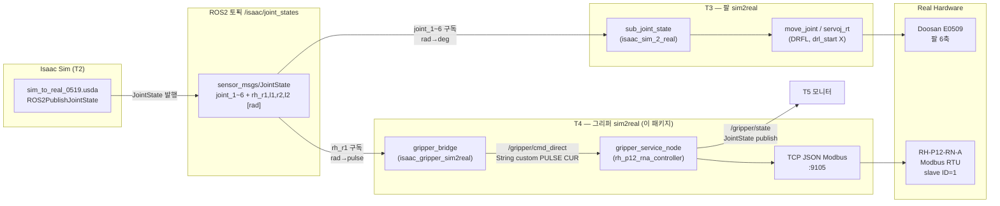
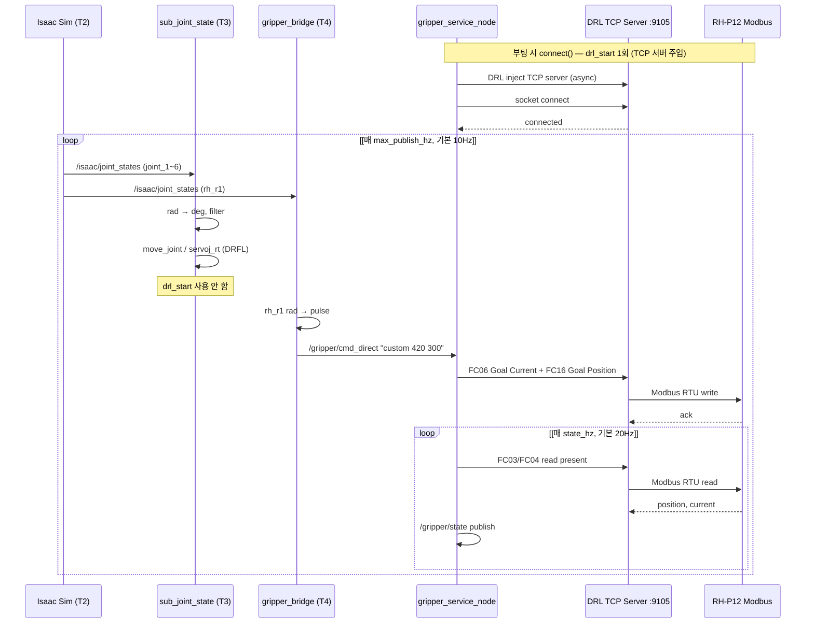

# isaac_gripper_sim2real

Isaac 그리퍼(`rh_r1`) → 실 RH-P12. **팔 브리지(T3)와 반드시 동시에** 켭니다.

> Clone: [isaacsimgrippersim2realv1](https://github.com/jasper104615-collab/isaacsimgrippersim2realv1)  
> Deploy repo: `docs/ARCHITECTURE_AND_WORKFLOW.md`

---

## 1. 시스템 구조도 (Architecture)

PLC Modbus 노드 구조와 같은 레이어로 표현한 **팔+그리퍼 동시 sim2real** 전체입니다.



### 레이어별 상세 (그리퍼 T4)

| 레이어 | 구성요소 | ROS 인터페이스 | 타입 / 단위 |
|--------|----------|----------------|-------------|
| **입력** | Isaac Sim | `/isaac/joint_states` | `JointState`, rad |
| **브리지** | `gripper_bridge` | 구독: `/isaac/joint_states` | `rh_r1` 추출 |
| **명령** | `gripper_bridge` | 발행: `/gripper/cmd_direct` | `String` `"custom 420 300"` |
| **Owner** | `gripper_service_node` | 구독: `/gripper/cmd_direct` | 큐 → TCP Modbus |
| **통신** | DRL TCP Server | `<ROBOT_IP>:9105` | JSON frame + Modbus FC06/FC16 |
| **하드웨어** | Tool Flange Serial | RS-485 Modbus RTU | RH-P12, slave ID **1** |
| **피드백** | `gripper_service_node` | 발행: `/gripper/state` | pulse(실측), effort(current) |

### ASCII 구조 (PLC 다이어그램 스타일)

```
┌─────────────────────────────────────────────────────────────────────────┐
│  Isaac Sim (T2)                                                         │
│  sim_to_real_0519.usda  ──►  /isaac/joint_states  (JointState, rad)    │
└───────────────────────────────┬─────────────────────────────────────────┘
                                │
           ┌────────────────────┴────────────────────┐
           ▼                                         ▼
┌──────────────────────┐                 ┌──────────────────────────────┐
│ T3 sub_joint_state   │                 │ T4 gripper_bridge            │
│ joint_1~6 구독       │                 │ rh_r1 구독                   │
│ rad → deg            │                 │ rad → pulse (100~420)        │
└──────────┬───────────┘                 └──────────────┬───────────────┘
           │                                            │
           ▼                                            ▼
┌──────────────────────┐                 ┌──────────────────────────────┐
│ move_joint           │                 │ /gripper/cmd_direct          │
│ servoj_rt_stream     │                 │ String "custom PULSE CUR"    │
│ (DRFL, drl_start X)  │                 └──────────────┬───────────────┘
└──────────┬───────────┘                                │
           │                                            ▼
           │                              ┌──────────────────────────────┐
           │                              │ gripper_service_node         │
           │                              │ command_transport:=tcp       │
           │                              │ direct_cmd_topic_enabled     │
           │                              └──────────────┬───────────────┘
           │                                            │
           ▼                                            ▼
┌──────────────────────┐                 ┌──────────────────────────────┐
│ Doosan E0509 팔      │                 │ TCP :9105 → Modbus RTU       │
│ (T1 bringup)         │                 │ reg 282 Goal Position        │
└──────────────────────┘                 └──────────────┬───────────────┘
                                                        ▼
                                           ┌──────────────────────────────┐
                                           │ RH-P12-RN-A (slave ID=1)     │
                                           └──────────────────────────────┘
```

---

## 2. 시퀀스 다이어그램 (Workflow)

PLC `read P020` / `write_coils` 흐름과 같은 형식입니다.



### 시퀀스 요약

| 단계 | 주체 | 동작 | drl_start |
|------|------|------|-----------|
| **부팅** | `gripper_service_node` | TCP 서버 DRL 주입 + socket connect | **1회** |
| **루프 (팔)** | `sub_joint_state` | `/isaac/joint_states` → move_joint | 없음 |
| **루프 (그리퍼)** | `gripper_bridge` | `rh_r1` → `/gripper/cmd_direct` | 없음 |
| **쓰기** | `gripper_service_node` | TCP → Modbus FC06/FC16 | 없음 |
| **읽기** | `gripper_service_node` | TCP → Modbus read → `/gripper/state` | 없음 |

→ **T3 + T4 동시 실행 가능** (`command_transport:=drl` 이면 쓰기마다 drl_start → **동시 불가**)

---

## 3. 이 패키지 역할 (T4)

| | T3 `sub_joint_state` | **T4 `gripper_bridge`** |
|--|----------------------|-------------------------|
| Isaac joint | `joint_1`~`6` | `rh_r1` |
| 실로봇 출력 | move_joint / servoj_rt | `/gripper/cmd_direct` |
| drl_start | 없음 | **명령마다 없음** (tcp) |

**T3 + T4 = 팔 + 그리퍼 동시 sim2real**

---

## 4. 동시 실행 명령 (T1~T5)

### 공통 source

```bash
source /opt/ros/humble/setup.bash
source ~/doosan-robot2/install/setup.bash
source ~/sim2real_deploy/ros2_ws/install/setup.bash
```

| 터미널 | 명령 |
|--------|------|
| **T1** | `ros2 launch dsr_bringup2 dsr_bringup2_rviz.launch.py mode:=real host:=<ROBOT_IP> model:=e0509` |
| **T2** | `isaac_assets/my_robot/sim_to_real_0519.usda` → Play |
| **T3** | 아래 팔 명령 |
| **T4** | 아래 그리퍼 launch (**T3와 동시**) |
| **T5** | `ros2 topic hz /isaac/joint_states` 등 확인 |

**T3 — 팔**

```bash
ros2 run isaac_sim_2_real sub_joint_state --ros-args \
  -p motion_mode:=move_joint \
  -p enable_motion:=true \
  -p input_topic:=/isaac/joint_states \
  -p max_publish_hz:=10.0 \
  -p move_joint_sync_type:=1
```

**T4 — 그리퍼**

```bash
ros2 launch isaac_gripper_sim2real sim2real_gripper.launch.py \
  robot_ip:=<ROBOT_IP> \
  enable_command:=true
```

**T5 — 확인**

```bash
ros2 topic hz /isaac/joint_states
ros2 topic echo /gripper/cmd_direct --once
ros2 topic echo /gripper/state --field position --once
```

---

## 5. DRL — 동시 가능 조건

| T3 + T4 조합 | 팔+그리퍼 동시 |
|--------------|----------------|
| move_joint + **tcp** + rh_p12_direct | **✅** |
| servoj_rt + **tcp** + rh_p12_direct | **✅** |
| * + 그리퍼 **drl** | **❌** |

---

## 6. 출력 모드

| `output_mode` | 출력 | T3와 동시 |
|---------------|------|-----------|
| **`rh_p12_direct`** (기본) | `/gripper/cmd_direct` | ✅ |
| `rh_p12_service` | `/gripper/set_position` srv | ✅ (느림) |
| `e0509_topic` | `/dsr01/gripper/position_cmd` Int32 | ✅ (e0509 bringup) |

---

## 7. 변환 (rh_r1 → pulse)

```
t = clamp(rh_r1_rad / 1.101, 0, 1)
pulse = round(100 + t * 320)    # 열림 100, 닫힘 420
```

---

## 8. 빌드

```bash
cd ~/sim2real_deploy/ros2_ws
colcon build --packages-select \
  rh_p12_rna_controller_interfaces rh_p12_rna_controller isaac_gripper_sim2real
source install/setup.bash
```

설정: `config/sim2real_gripper.yaml`

---

## 9. RViz — 실로봇 + 그리퍼 시각화

URDF: `dsr_description2/urdf/e0509_with_gripper.urdf` (USD joint origin과 동일, RH-P12 mimic 포함)

**한 번에 실행 (권장):**

```bash
source ~/doosan-robot2/install/setup.bash
source ~/sim2real_deploy/ros2_ws/install/setup.bash

ros2 launch isaac_gripper_sim2real real_rviz_with_gripper.launch.py \
  mode:=real host:=110.120.1.40 port:=12345 model:=e0509 robot_ip:=110.120.1.40
```

동작:
- 팔: `joint_state_broadcaster` → `/dsr01/joint_states` (rad)
- 그리퍼: `gripper_service_node` → `/gripper/state` (`gripper_joint`, pulse 0~700)
- 병합: `rviz_joint_state_merger` → pulse→`rh_r1` rad → `/dsr01/joint_states_rviz`
- RViz URDF: `e0509_with_gripper.urdf`, `robot_state_publisher`는 `joint_states_rviz` 구독

**기존 dsr bringup 쓰는 경우 (overlay):**

```bash
# T1: dsr bringup (robot_state_publisher를 gripper URDF + joint_states_rviz remap으로 수동 교체 필요)
ros2 launch dsr_bringup2 dsr_bringup2_rviz.launch.py mode:=real host:=110.120.1.40 port:=12345 model:=e0509

# T2: 그리퍼 피드백 + joint_states 병합
ros2 launch isaac_gripper_sim2real rviz_gripper_overlay.launch.py robot_ip:=110.120.1.40
```
